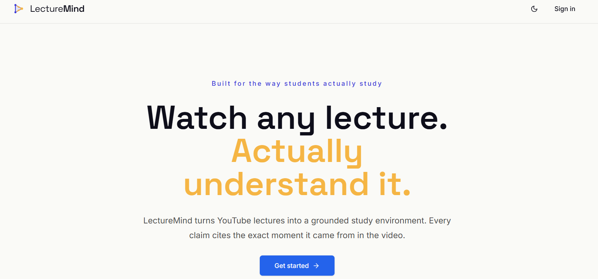
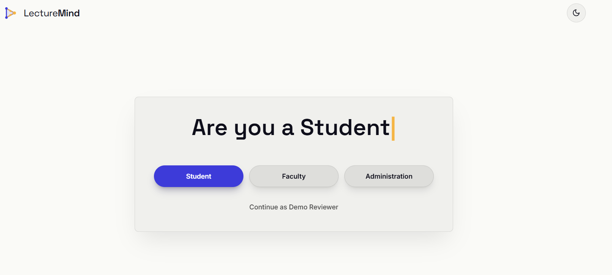
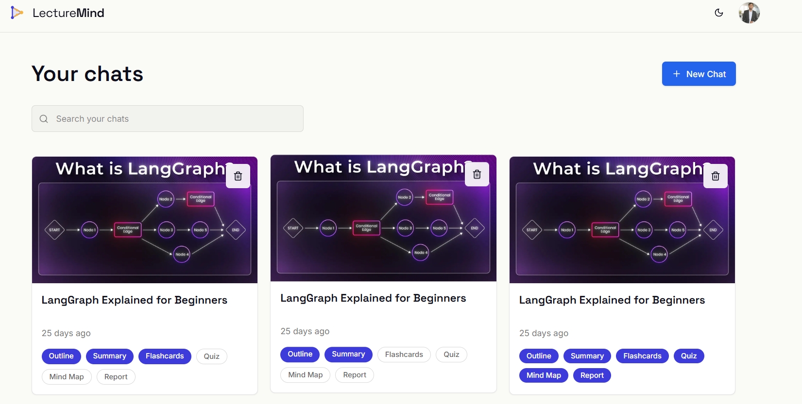
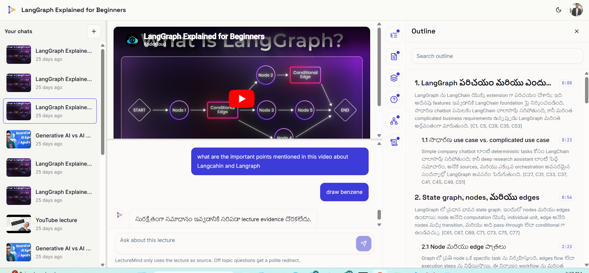
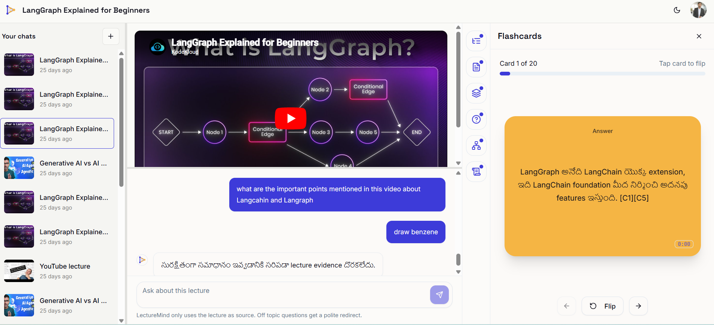
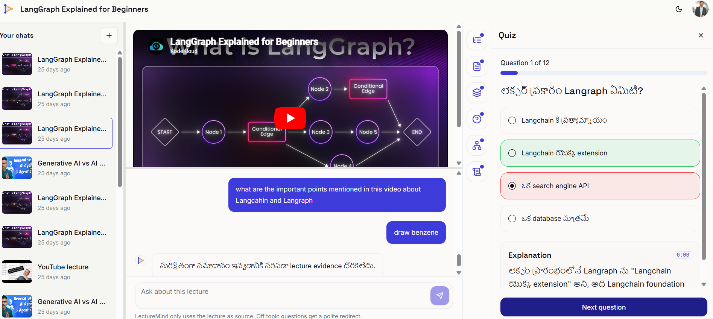
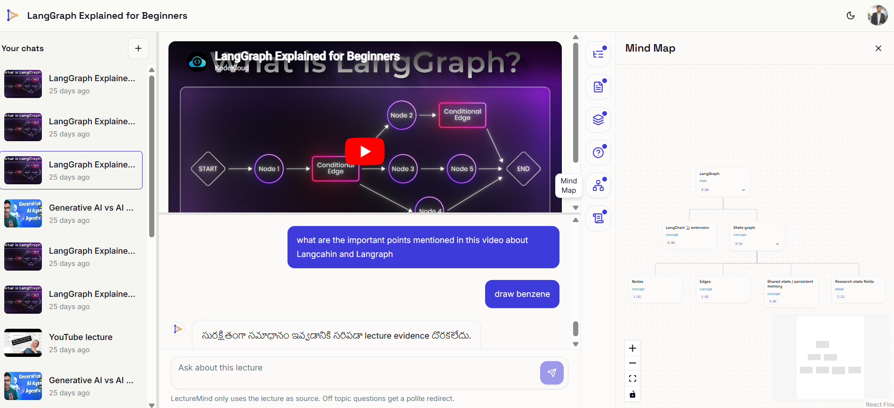
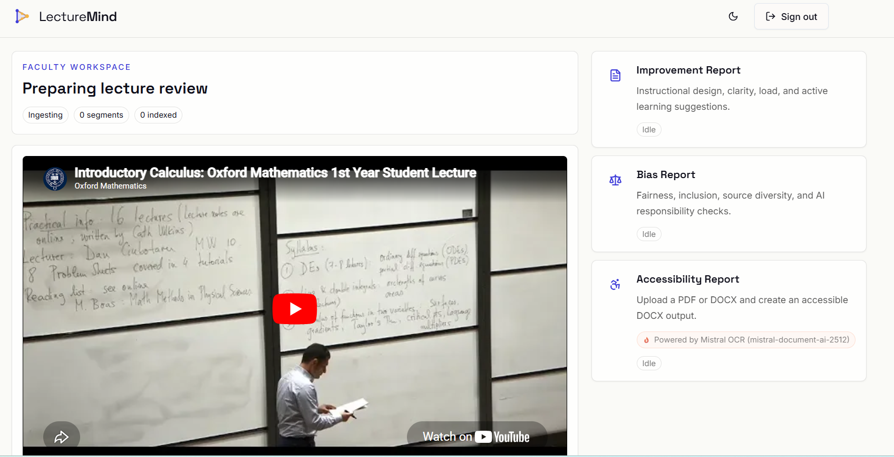

# LectureMind-AI

**An open-source AI study assistant that turns lectures into grounded, citable learning material.**

[](LICENSE)
[](#open-source-impact)
[](CONTRIBUTING.md)
[](.github/workflows/ci.yml)
[](https://nextjs.org)

> **Project status: early-stage, actively developed open-source project.** Core lecture ingestion, AI study-artifact generation, source-grounded chat, and a separate faculty review workspace are implemented. Many study-input formats and integrations are on the [Roadmap](ROADMAP.md).

---

## The problem

Students lose hours rewatching long lectures, scrubbing through videos to re-find one explanation, and rebuilding their own notes, flashcards, and practice questions by hand. Most AI study tools that try to help are closed, opaque about *where their answers come from*, and often hallucinate facts that were never in the lecture. For a student preparing for an exam, an answer with no source is worse than no answer at all.

## The solution

LectureMind-AI converts a lecture into structured, **source-grounded** study material. Every generated summary, flashcard, quiz question, and chat answer is tied back to a specific moment in the source transcript through a deterministic citation verifier — clicking a citation seeks the embedded video to that exact timestamp. If the model cannot ground a claim in the evidence, the answer is rejected rather than shown as fact.

It is built to be a **transparent, extensible, community-driven alternative** for AI-assisted learning: the prompts, the retrieval logic, the verification rules, and the data model are all open and inspectable.

## Who it is for

- **Students** who want to study from lectures faster, with material they can trust and trace back to the source.
- **Educators** who want to review their own recorded lectures and generate improvement and bias-awareness reports.
- **Teaching assistants** who prepare revision material, quizzes, and accessible documents for a class.
- **Self-learners** working through public lecture content who want structured notes and active-recall tools.
- **University AI clubs and academic communities** looking for an open, hackable reference implementation of a grounded, citation-verified RAG pipeline for education.

---

## Key features

These features are implemented in the current codebase.

### Student study workspace
- **YouTube lecture ingestion** — paste a public watch / short / live / `youtu.be` URL; the server validates and normalizes it, fetches metadata and captions, and stores every line as a timestamped `EvidenceSegment`.
- **Hybrid transcript pipeline** — Node caption ingestion first, with an optional Python worker fallback (yt-dlp captions/subtitles, ffmpeg audio prep, Azure Speech ASR) when captions are missing.
- **AI study artifacts** generated from the transcript:
  - Structured outline
  - 90-second summary
  - 5-minute summary
  - Study guide
  - Flashcards
  - Quiz
  - Mind map
- **Source-grounded chat** — ask questions about the lecture and get answers with timestamp citation chips. A deterministic verifier rejects unsupported or fabricated citations.
- **Citation seeking** — every citation chip in chat and artifacts seeks the embedded YouTube player to the cited moment.
- **Multilingual artifact generation** — generate and store artifacts (outline, summaries, flashcards, quiz, mind map) in multiple languages (e.g., English, Spanish, Telugu) without overwriting each other.
- **Safe failure handling** — private, caption-less, region-blocked, or over-length videos produce a typed, friendly failure card instead of a raw stack trace.

### Faculty review workspace (isolated)
- Short-lived, heartbeat-managed faculty sessions, fully isolated from student data (separate workspace records, search namespace, and blob container).
- **Improvement** and **bias-awareness** reports generated from retrieved lecture evidence using structured-output schema validation.
- **Accessibility remediation** — upload a PDF/DOCX, extract structure with Mistral OCR, and download a remediated accessible DOCX.
- **Dependency health endpoint** that checks real reachability of the model, embeddings, search index, blob container, and OCR service.

### Engineering foundations
- Server-side-only model calls — the browser never receives model credentials and never calls the model directly.
- Zod-validated inputs and strict schema validation on all AI outputs.
- Ownership-checked retrieval — transcript text is never returned for a notebook the user does not own.
- PostgreSQL-backed job model for async artifact generation and indexing.
- Vitest unit tests for faculty logic, schemas, isolation, and YouTube URL handling.

> See the [Roadmap](ROADMAP.md) for planned inputs (PDF / transcript / notes as *study* sources), exports, classroom workflows, and LMS integrations.

---

## Roadmap (summary)

Planned work, in priority order. Full detail lives in [ROADMAP.md](ROADMAP.md).

- **Near-term:** docs polish, easier local setup, more tests, a basic evaluation workflow, demo video, sample lecture datasets.
- **Mid-term:** improved RAG pipeline, **PDF / transcript / pasted-notes as study inputs**, quiz difficulty levels, flashcard export, classroom use cases, UI improvements, a public API surface.
- **Long-term:** plugin architecture, LMS integrations, privacy-preserving / local-model workflows, multi-modal lecture support, a broader contributor ecosystem.
- **Security:** secret scanning, dependency scanning, file-upload validation, prompt-injection tests, and model-output safety tests in CI.

---

## Architecture overview

```text
YouTube URL
  -> Notebook row (PENDING)
  -> ingestion (Node captions, optional Python worker + Azure Speech fallback)
  -> EvidenceSegment rows (timestamped transcript)
  -> automatic Azure AI Search indexing when configured
  -> shared grounded retrieval layer
       -> AI study artifacts (outline, summaries, guide, flashcards, quiz, mind map)
       -> source-grounded chat
  -> deterministic citation verification
  -> UI with timestamp citation chips that seek the video
```

- **Next.js routes** own authentication, input validation, and safe JSON responses.
- **Prisma / PostgreSQL** owns notebook, evidence, artifact, chat, and durable job state.
- **`lib/ai/*`** owns model calls, artifact schemas, and the citation/model verifiers.
- **`lib/search/*`** owns embeddings and Azure AI Search indexing/querying.
- **`lib/retrieval/*`** owns ownership-safe evidence retrieval shared by chat and artifacts.
- **`lib/faculty/*`** owns the isolated faculty session, reports, OCR, and accessibility pipeline.

When Azure AI Search and embeddings are configured, retrieval uses Azure hybrid search; otherwise it falls back to local lexical retrieval over the notebook's own evidence. A full write-up is in [docs/architecture.md](docs/architecture.md).

## Tech stack

| Layer | Technology |
| --- | --- |
| Framework | Next.js 15 (App Router), React 18, TypeScript |
| Styling/UI | Tailwind CSS, Radix UI primitives, Framer Motion, Lucide icons |
| State | Zustand |
| Auth | NextAuth / Auth.js (Google provider) + Prisma adapter |
| Database | PostgreSQL via Prisma ORM |
| Validation | Zod + `zod-to-json-schema` |
| AI (models) | Azure OpenAI (artifact generation, chat, embeddings) |
| Retrieval | Azure AI Search hybrid retrieval, with local lexical fallback |
| Storage | Azure Blob Storage (faculty uploads + generated DOCX) |
| Transcription | YouTube captions; optional Python/FastAPI worker (yt-dlp, ffmpeg, Azure Speech) |
| Documents | Mistral OCR, `docx`, `pdf-lib` (faculty accessibility) |
| Testing | Vitest |

> The model layer currently targets **Azure OpenAI**. The provider boundary lives in `lib/ai/azure-openai.ts`; supporting other OpenAI-compatible providers is on the roadmap.

---

## Installation

### Prerequisites

- Node.js 20+
- PostgreSQL database
- (Optional) Python 3.11+ and ffmpeg for the worker / ASR fallback
- (Optional) Azure OpenAI, Azure AI Search, Azure Blob Storage, and Mistral OCR credentials for full AI features

### Steps

```bash
# 1. Install dependencies
npm install

# 2. Create your local environment file
cp .env.example .env

# 3. Generate the Prisma client and run migrations
npm run check-env
npm run prisma:generate
npm run prisma:migrate

# 4. Start the dev server
npm run dev
```

Open <http://localhost:3000>.

### What works without AI keys

If Azure OpenAI / Search keys are absent, transcript ingestion and local lexical retrieval still work, and AI features **fail safely** with a clear `AI_NOT_CONFIGURED`-style message instead of crashing or showing placeholder answers. This makes the project easy to clone and explore before wiring up any paid services.

### Environment variables

Copy [.env.example](.env.example) to `.env` and fill in the values. `.env` is gitignored and is never read in `.env.example` form at runtime. Key groups:

| Group | Variables | Required for |
| --- | --- | --- |
| Core | `DATABASE_URL`, `NEXTAUTH_SECRET`, `NEXTAUTH_URL` | Running the app |
| Auth | `GOOGLE_CLIENT_ID`, `GOOGLE_CLIENT_SECRET` | Google sign-in |
| Models | `AZURE_OPENAI_ENDPOINT`, `AZURE_OPENAI_API_KEY`, `AZURE_OPENAI_DEPLOYMENT_FAST` / `_STRONG` | Artifacts & chat |
| Embeddings/Search | `AZURE_OPENAI_EMBEDDING_DEPLOYMENT`, `AZURE_SEARCH_ENDPOINT`, `AZURE_SEARCH_API_KEY` | Hybrid retrieval |
| Worker/ASR | `LECTUREMIND_WORKER_URL`, `AZURE_SPEECH_KEY`, `AZURE_SPEECH_REGION` | Caption-less videos |
| Faculty | `FACULTY_PRIMARY_MODEL_DEPLOYMENT`, `AZURE_STORAGE_*`, `MISTRAL_OCR_*` | Faculty workspace |

> **Never commit real secrets.** Use `.env` locally and your platform's secret manager in deployment. See [SECURITY.md](SECURITY.md).

### Optional Python worker

The worker enables yt-dlp and Azure Speech ASR for videos without captions.

```bash
cd worker
python -m venv .venv
.venv\Scripts\activate          # macOS/Linux: source .venv/bin/activate
pip install -r requirements.txt
uvicorn app.main:app --reload --port 8000
```

Health check: `curl http://localhost:8000/health`.

---

## Example workflows

**Student — study a lecture**
1. Sign in and create a notebook from a public YouTube lecture URL.
2. Wait for ingestion to reach `READY` (transcript appears with timestamp chips).
3. In the Studio panel, generate an outline, summaries, study guide, flashcards, a quiz, and a mind map.
4. Ask the chat a question; click any citation chip to jump the video to the cited moment.

**Educator — review a lecture**
1. Open the Faculty dashboard and start a session from a lecture URL.
2. Generate an Improvement report and a Bias-awareness report from the retrieved evidence.
3. Upload a PDF/DOCX to the Accessibility card and download a remediated accessible DOCX.

---

## Screenshots

### Landing & onboarding

| Landing page | Choose your role |
| --- | --- |
|  |  |

### Student study workspace

The dashboard lists your lectures; opening one gives you the embedded video, transcript, grounded chat, and a studio of AI artifacts. Generated content is **multilingual** — the example below is rendered in Telugu — and every claim carries timestamp citation chips (`[C1]`, `[C5]`, …) that seek the video.

| Dashboard | Outline (multilingual + citations) |
| --- | --- |
|  |  |

| Flashcards | Quiz |
| --- | --- |
|  |  |

| Mind map |
| --- |
|  |

> Off-topic questions are politely redirected (e.g., "draw benzene" returns "no lecture evidence found") — the assistant only answers from the lecture, which keeps it grounded.

### Faculty review workspace

Instructors get a separate, isolated workspace with **Improvement** and **Bias** reports generated from the lecture evidence, plus an **Accessibility** card that uses **Mistral OCR** to turn an uploaded PDF/DOCX into an accessible DOCX.



## Demo video

> _A short demo walkthrough is planned (see [ROADMAP.md](ROADMAP.md)). Link will be added here: `_TODO: demo video URL_`._

---

## Project structure

```text
LectureMind-AI/
├── app/                      # Next.js App Router (pages + API routes)
│   ├── api/                  # Server routes: notebooks, faculty, jobs, auth, health
│   ├── faculty/              # Faculty dashboard & workspace UI
│   └── start/                # Onboarding / entry flows
├── components/               # UI components (workspace, studio, faculty, shared)
├── lib/
│   ├── ai/                   # Model calls, artifact schemas, verifier, prompts
│   ├── chat/                 # Source-grounded answer generation
│   ├── retrieval/            # Ownership-safe evidence retrieval
│   ├── search/               # Embeddings + Azure AI Search indexing/querying
│   ├── ingestion/            # Local job queue abstraction
│   ├── faculty/              # Faculty sessions, reports, OCR, accessibility, storage
│   └── config/               # Server environment resolution
├── prisma/                   # schema.prisma + migrations
├── scripts/                  # Env checks, local retrieval/chat contract tests, seeds
├── tests/                    # Vitest unit tests (faculty, youtube, worker)
├── worker/                   # Optional FastAPI worker (yt-dlp, ffmpeg, Azure Speech)
├── docs/                     # Architecture, security, impact, application docs
└── .github/                  # CI workflow, issue/PR templates
```

## API & model usage

- All model calls are **server-side only** through `lib/ai/azure-openai.ts`. Browser code never holds model credentials.
- Artifact and chat outputs are validated against strict Zod schemas, then passed through a deterministic citation verifier plus an optional model verifier. Unverifiable output is repaired once, then safely rejected.
- Retrieval is ownership-scoped and, when configured, uses Azure AI Search hybrid queries filtered by `notebookId` and `userId`; results are canonicalized against database rows before the model sees them.

See [docs/api-credit-use.md](docs/api-credit-use.md) for how the project uses (and intends to use) model API credits responsibly.

## Privacy & security

LectureMind-AI processes user-provided lecture URLs and, in the faculty workspace, uploaded academic documents. Security is treated as a first-class concern:

- Secrets live in `.env` / platform secret managers, never in code.
- Uploaded faculty documents are isolated per session in a dedicated blob container with short-lived sessions.
- Logs exclude secrets, raw transcripts, tokens, and user email by default; verbose AI logging is gated behind `DEBUG_AI` and intended to stay off.
- Citation verification reduces the risk of fabricated or ungrounded answers being presented as source truth.

Full details and the threat model are in [docs/security-considerations.md](docs/security-considerations.md). To report a vulnerability, see [SECURITY.md](SECURITY.md).

---

## Contributing

Contributions of all kinds are welcome — bug reports, docs, UI, backend, model/evaluation work, security, and tests. Start with [CONTRIBUTING.md](CONTRIBUTING.md), and please follow the [Code of Conduct](CODE_OF_CONDUCT.md).

Good first contributions: improving setup docs, adding tests, wiring up screenshots, and the "good first issue" candidates listed in [ROADMAP.md](ROADMAP.md).

## Open-source impact

LectureMind-AI aims to make AI-assisted studying more **accessible and trustworthy**: a transparent, hackable tool that helps students learn from long lectures and dense material without shifting the cost or the black-box risk onto them. See [docs/open-source-impact.md](docs/open-source-impact.md) for who this is built to help and why it matters.

## Maintainer note

LectureMind-AI is maintained by **Akash Nallagonda** as an open educational AI project. It is early-stage and built in the open: the goal is a credible, well-documented, security-conscious foundation that contributors and students can learn from and build on. Feedback, issues, and pull requests are genuinely appreciated.

## License

Released under the [MIT License](LICENSE). Copyright (c) 2026 Akash Nallagonda.

## Contact

- Maintainer: **Akash Nallagonda**
- Email: **akashnallagonda9@gmail.com**
- Issues & feature requests: please use the [GitHub issue templates](.github/ISSUE_TEMPLATE/)
- Security reports: see [SECURITY.md](SECURITY.md)

> Looking for the detailed development history? Phase-by-phase implementation notes live under [docs/](docs/) (`phase-2` through `phase-7`).
